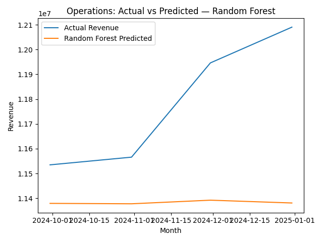

# FP&A Forecasting Models

This project demonstrates how different machine learning models can be applied to financial planning & analysis (FP&A) forecasting.  
The dataset is a synthetic FP&A dataset (Revenue, Cost, EBIT across departments) covering 24 months.

I built and compared three forecasting approaches:

---

## 1. Linear Regression
- Captures overall **trend** using a time index (`t`) and lagged features (`Rev_Lag1`, `Cost_Lag1`, `EBIT_Lag1`).
- **Strengths**: Simple, transparent, works well for steady upward/downward trends.
- **Weaknesses**: Misses seasonality (e.g., Q4 spikes).

Outputs:  
- `outputs/linear_predictions.csv`  
- `outputs/linear_metrics.csv`  

---

## 2. Random Forest Regression
- Captures **non-linear relationships** between features and revenue.
- **Strengths**: Flexible, can handle multiple drivers at once.
- **Weaknesses**: Needs a lot more data; struggled with this small dataset → overfitted and performed poorly.

Outputs:  
- `outputs/rf_predictions.csv`  
- `outputs/rf_metrics.csv`  
- Chart:  
  

---

## 3. Prophet (coming soon)
- Designed for **time-serie**

